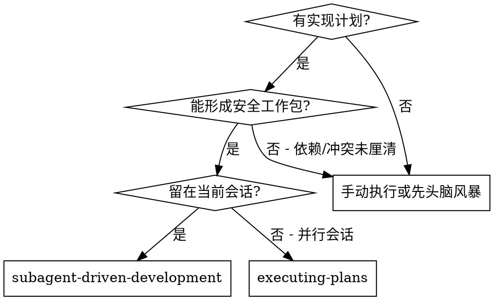
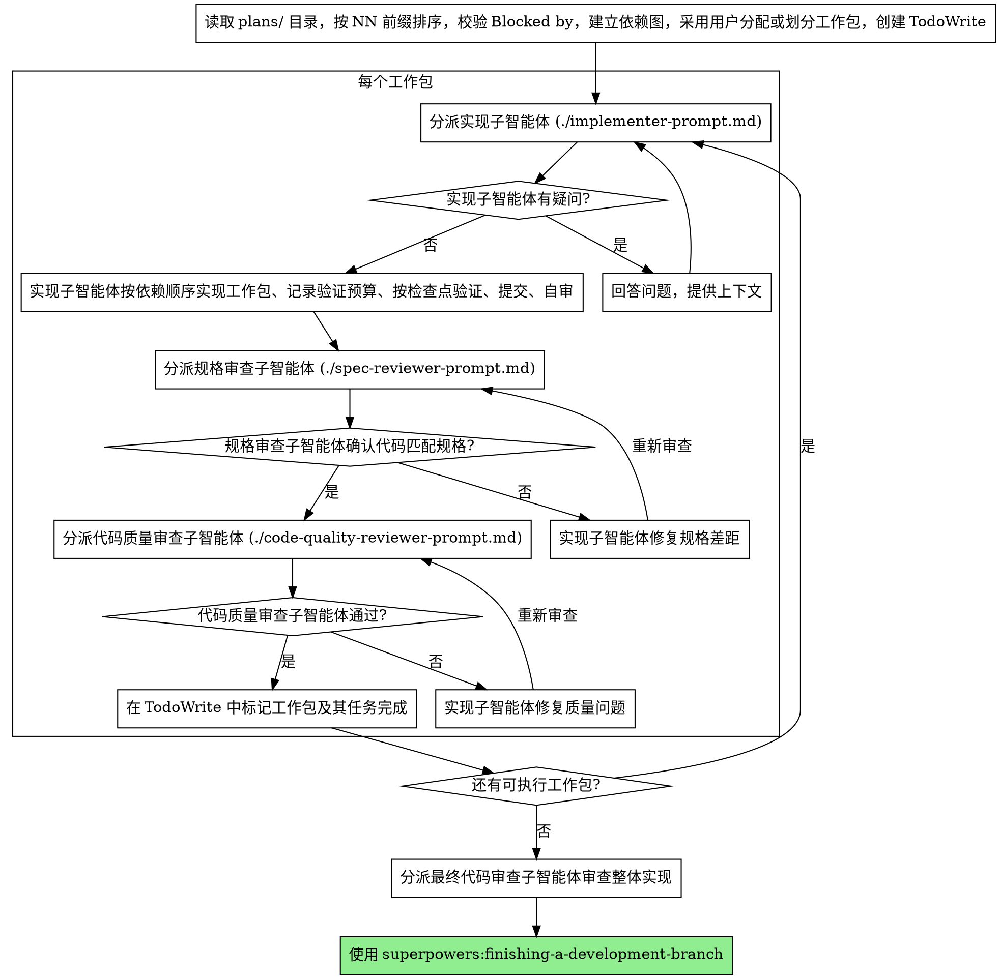

# 子智能体驱动开发

通过把计划文件组织成安全的工作包，并为每个工作包分派合适的子智能体来执行计划。每个工作包可以包含一个或多个相关任务；控制者负责依赖排序、验证预算、检查点合并和审查节奏。

**为什么用子智能体：** 你将任务委派给具有隔离上下文的专用智能体。通过精心设计它们的指令和上下文，确保它们专注并成功完成任务。它们不应继承你的会话上下文或历史记录——你要精确构造它们所需的一切。这样也能为你自己保留用于协调工作的上下文。

**核心原则：** 先校验 `Blocked by` + 建立依赖图 + 按任务量、相关性和冲突风险划分工作包 + 验证预算先行 + 按检查点合并验证 + 两阶段审查（先规格后质量）= 高质量、快速迭代

## 何时使用



**与 Executing Plans（并行会话）的对比：**
- 同一会话（无上下文切换）
- 每个工作包使用隔离上下文；相关小任务可以合并，互不依赖且无冲突的工作包可以并行
- 每个任务仍记录验证预算和测试策略；低风险任务可并入验证检查点，高风险任务即时验证
- 每个工作包完成后两阶段审查：先规格合规性，再代码质量
- 更快的迭代（任务间无需人工介入）

## 流程



执行前必须读取计划目录，而不是旧的单文件多任务计划。若用户提供单个 Markdown 计划文件，先检查是否为旧格式；如果包含多个任务或横向层拆分，停止执行并告知用户需要先迁移为 `docs/superpowers/YYYY-MM-DD-<feature-name>/plans/NN-<slice-name>.md` 多文件 vertical slice 计划。

## 工作包划分

控制者先读取所有计划文件并建立依赖图，再决定子智能体分配。用户已经明确指定任务由哪些子智能体执行时，优先采用用户分配；用户没有分配时，控制者按下面规则划分工作包。不要机械地按计划文件数量分派子智能体。

**用户已分配时：**
- 先校验用户分配是否满足 `Blocked by` 依赖顺序
- 校验同一时间并行的工作包是否存在写入冲突或验证冲突
- 校验重型验证是否仍由控制者统一预算和调度
- 如果用户分配安全，按用户分配执行
- 如果用户分配会越过依赖、造成冲突或放大验证成本，先说明问题并提出最小调整，不要直接执行

**可以合并到同一工作包：**
- 任务量都小，且共享主要上下文或写入范围
- 后一个任务直接依赖前一个任务，适合由同一子智能体顺序完成
- 多个任务使用同一个验证检查点，合并执行能减少重复测试成本
- 合并后仍能保持清晰边界和可审查报告

**应拆成不同工作包：**
- 任务量大，合并后会让子智能体上下文过载
- 任务之间没有共享上下文，合并只会增加理解成本
- 写入范围可能冲突，或并行修改会互相覆盖
- 风险等级不同，高风险任务需要独立审查或即时验证

**并行条件：**
- 工作包之间没有未完成依赖
- 写入范围不冲突，验证检查点不互相争用
- 失败时能清楚定位到对应工作包
- 并行不会导致重型验证重复运行

如果工作包内包含依赖链，子智能体必须按依赖顺序推进，不能越过未完成依赖。控制者负责把工作包内每个计划文件的完整文本、依赖关系、验证预算和检查点交给子智能体。

## 模型选择

使用能胜任每个角色的最低成本模型，以节省开支并提高速度。

**机械性工作包**（隔离、清晰、低风险）：使用快速、便宜的模型。当计划编写得足够详细时，大多数小工作包都是机械性的。

**集成和判断类工作包**（多任务协调、模式匹配、调试）：使用标准模型。

**架构、设计和审查类任务**：使用最强的可用模型。

**任务复杂度信号：**
- 任务量小、依赖清楚、写入范围集中 → 便宜模型
- 涉及多个相关任务、需要协调依赖或共享上下文 → 标准模型
- 需要设计判断或广泛的代码库理解 → 最强模型

## 处理实现者状态

实现子智能体报告四种状态之一。根据每种状态进行相应处理：

**DONE：** 进入规格合规性审查。

**DONE_WITH_CONCERNS：** 实现者完成了工作但标记了疑虑。在继续之前阅读这些疑虑。如果疑虑涉及正确性或范围，在审查前解决。如果只是观察性说明（如"这个文件越来越大了"），记录下来并继续审查。

**NEEDS_CONTEXT：** 实现者需要未提供的信息。提供缺失的上下文并重新分派。

**BLOCKED：** 实现者无法完成任务。评估阻塞原因：
1. 如果是上下文问题，提供更多上下文并用同一模型重新分派
2. 如果任务需要更强的推理能力，用更强的模型重新分派
3. 如果任务太大，拆分为更小的部分
4. 如果计划本身有问题，上报给人类

**绝不** 忽略上报或在不做任何更改的情况下让同一模型重试。如果实现者说卡住了，说明有什么东西需要改变。

## 提示词模板

- `./implementer-prompt.md` - 分派实现子智能体
- `./spec-reviewer-prompt.md` - 分派规格合规审查子智能体
- `./code-quality-reviewer-prompt.md` - 分派代码质量审查子智能体

## 示例工作流

```
你：我正在使用子智能体驱动开发来执行这个计划。

[一次性读取计划目录：docs/superpowers/2026-07-09-feature-name/plans/]
[按 01-*.md、02-*.md 顺序读取全部 5 个计划文件，校验 Blocked by，建立依赖图]
[用户未指定子智能体分配，控制者自动划分工作包：工作包 A = 01-install-hook + 03-recovery-mode；工作包 B = 02-config-loader + 04-progress-report + 05-final-check]
[用所有任务和工作包创建 TodoWrite]

工作包 A：Hook 安装脚本 + 恢复模式

[获取 plans/01-install-hook.md 和 plans/03-recovery-mode.md 的文本和上下文（已提取）]
[分派实现子智能体，附带完整工作包文本 + 依赖顺序 + 验证预算]

实现者："在我开始之前——hook 应该安装在用户级别还是系统级别？"

你："用户级别（~/.config/superpowers/hooks/）"

实现者："明白了。现在开始实现……"
[稍后] 实现者：
  - 实现了 install-hook 命令
  - 按依赖顺序实现了 recovery mode
  - 测试策略：B 实现优先目标验证，并入检查点 1
  - 验证预算：重型验证 0/2 次
  - 检查点 1 验证：交由控制者统一运行
  - 自审：发现遗漏了 --force 参数，已添加
  - 已提交

[分派规格合规审查]
规格审查者：✅ 符合规格 - 所有需求已满足，无多余内容

[获取 git SHA，分派代码质量审查]
代码审查者：优点：测试覆盖好，代码整洁。问题：无。通过。

[标记工作包 A 及其中任务完成]

工作包 B：配置加载 + 进度报告 + 最终核查

[获取工作包 B 的所有计划文本和上下文（已提取）]
[确认工作包 B 不依赖未完成任务，且写入范围不与工作包 A 冲突后分派]

实现者：[无疑问，直接开始]
实现者：
  - 完成了配置加载、进度报告和最终核查路径
  - 测试策略：C 轻量核查，并入检查点 2
  - 验证预算：不使用重型验证
  - 检查点 2 验证：静态核查通过，用户验收路径已列出
  - 自审：一切正常
  - 已提交

[分派规格合规审查]
规格审查者：❌ 问题：
  - 缺失：进度报告（规格要求"每 100 项报告一次"）
  - 多余：添加了 --json 参数（未被要求）

[实现者修复问题]
实现者：移除了 --json 参数，添加了进度报告

[规格审查者再次审查]
规格审查者：✅ 现在符合规格

[分派代码质量审查]
代码审查者：优点：扎实。问题（重要）：魔法数字（100）

[实现者修复]
实现者：提取了 PROGRESS_INTERVAL 常量

[代码审查者再次审查]
代码审查者：✅ 通过

[标记工作包 B 及其中任务完成]

...

[所有任务完成后]
[分派最终代码审查]
最终审查者：所有需求已满足，可以合并

完成！
```

## 优势

**与手动执行相比：**
- 子智能体先选择验证预算和测试策略，只有高风险行为变更才遵循 TDD
- 每个工作包使用隔离上下文（不会混淆）
- 并行只发生在无依赖、无写入冲突、无验证冲突的工作包之间
- 子智能体可以提问（工作前和工作中都可以）

**与 Executing Plans 相比：**
- 同一会话（无交接）
- 持续进展（无需等待）
- 审查检查点自动化

**效率提升：**
- 无文件读取开销（控制者提供完整文本）
- 控制者精确策划所需上下文
- 子智能体预先获得完整信息
- 问题在工作开始前就被提出（而非工作结束后）

**质量关卡：**
- 自审在交接前发现问题
- 两阶段审查：规格合规性，然后代码质量
- 审查循环确保修复确实有效
- 规格合规防止过度/不足构建
- 代码质量确保实现良好

**成本：**
- 更多子智能体调用（每个工作包需要实现者 + 审查者）
- 控制者需要更多准备工作（预先提取所有任务、建立依赖图、划分工作包）
- 审查循环增加迭代次数
- 验证检查点减少重复运行重型测试或编译的次数
- 测试成本不得因工作包或子智能体数量增加而线性放大；重型验证由控制者统一预算和调度
- 但能及早发现问题（比后期调试更省成本）

## 红线

**绝不：**
- 未经用户明确同意就在 main/master 分支上开始实现
- 跳过审查（规格合规性或代码质量）
- 带着未修复的问题继续
- 并行执行存在依赖冲突、写入冲突或验证冲突的工作包
- 直接执行旧的单文件多任务计划（必须先迁移为多文件 vertical slice 计划）
- 让子智能体读取计划文件（应提供完整文本）
- 跳过场景铺设上下文（子智能体需要理解任务在哪个环节）
- 忽视子智能体的问题（在让它们继续之前先回答）
- 在规格合规性上接受"差不多就行"（规格审查者发现问题 = 未完成）
- 跳过审查循环（审查者发现问题 = 实现者修复 = 再次审查）
- 让实现者的自审替代正式审查（两者都需要）
- **在规格合规性审查通过之前开始代码质量审查**（顺序错误）
- 在任一审查有未解决问题时就进入下一个任务

**如果子智能体提问：**
- 清晰完整地回答
- 必要时提供额外上下文
- 不要催促它们进入实现阶段

**如果审查者发现问题：**
- 实现者（同一子智能体）修复
- 审查者再次审查
- 重复直到通过
- 不要跳过重新审查

**如果子智能体失败：**
- 分派修复子智能体并提供具体指令
- 不要尝试手动修复（上下文污染）

## 集成

**必需的工作流技能：**
- **superpowers:using-git-worktrees** - 必需：在开始前建立隔离工作区
- **superpowers:testing-policy** - 必需：子智能体和控制者都按风险选择验证预算和测试/验证策略
- **superpowers:writing-plans** - 创建本技能执行的计划
- **superpowers:requesting-code-review** - 审查子智能体的代码审查模板
- **superpowers:finishing-a-development-branch** - 所有任务完成后收尾

**子智能体应使用：**
- **superpowers:testing-policy** - 对工作包及其中每个任务记录验证预算、测试策略、理由和验证检查点
- **superpowers:test-driven-development** - 仅当 testing-policy 判定为 A 强制 TDD 时使用

**替代工作流：**
- **superpowers:executing-plans** - 用于并行会话而非同会话执行
